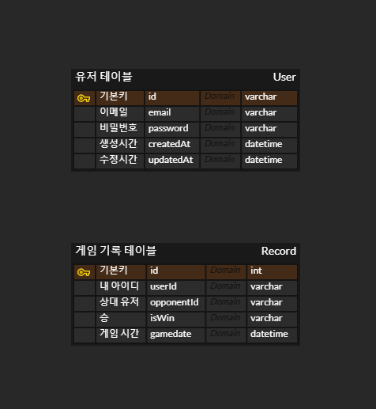

# Project : Protect My Precious Fire Egg

## Description : 화룡이 되어 못된 오우거로부터 소중한 알을 보호하세요!

---

## ✨기술스택

  

   
   


## 🛠 Tools


    


 

## 🧰 라이브러리

```
"bcrypt"
"dotenv"
"joi"
"jsonwebtoken"
"jwt-decode"
"lodash"
"mysql2"
"protobufjs"
"redis"
"uuid"
```

---

# 트러블슈팅

### 데이터베이스 테이블 생성 참조 에러 트러블 슈팅

- 문제상황

```
유저의 정보는 user_db에 저장 게임기록은 record_db에 저장하려 했으나

record_db에서 user_db의 userId를 외레키로 사용할경우 Reference에러가 발생한다.
```

- 해결방안

```
1.user_db에 user테이블과 record테이블을 함께 작성한다.

2.record_db에서 user_db자체를 참조한다.
```

- 실제 해결 방법

```
MySQL InnoDB를 사용하여 user_db자체를 참조한다.
```

- 수정전 코드

```ruby

user_db.sql 테이블 생성코드

CREATE TABLE IF NOT EXISTS `User` (
    userId VARCHAR(255) AUTO_INCREMENT PRIMARY KEY E,
    email VARCHAR(255) NOT NULL UNIQUE,
    password VARCHAR(255) NOT NULL,
    createAt DATETIME DEFAULT CURRENT_TIMESTAMP,
    updatedAt DATETIME DEFAULT CURRENT_TIMESTAMP ON UPDATE CURRENT_TIMESTAMP
);


recode_db.sql 테이블 생성코드

CREATE TABLE IF NOT EXISTS Record(
    id INT(11) AUTO_INCREMENT PRIMARY KEY,
    userId VARCHAR(255) NOT NULL UNIQUE,  -- 플레이어 1 ID
    opponentId VARCHAR(255) NOT NULL,  -- 플레이어 2 ID
    isWin BOOLEAN NOT NULL,  -- 승/패 여부
    gameDate TIMESTAMP DEFAULT CURRENT_TIMESTAMP,  -- 게임 날짜
    FOREIGN KEY (userId) REFERENCES user (userId)
);

//user_db에서 userId를 참조하려고했지만 서로 다른 DB이므로 연결이 불가하다.
```

-수정후 코드

```ruby
user 테이블 생성 코드

CREATE TABLE IF NOT EXISTS `User` (
    userId VARCHAR(255) AUTO_INCREMENT PRIMARY KEY E,
    email VARCHAR(255) NOT NULL UNIQUE,
    password VARCHAR(255) NOT NULL,
    createAt DATETIME DEFAULT CURRENT_TIMESTAMP,
    updatedAt DATETIME DEFAULT CURRENT_TIMESTAMP ON UPDATE CURRENT_TIMESTAMP
);

record 테이블 생성 코드

CREATE TABLE IF NOT EXISTS Record(
   id INT(11) AUTO_INCREMENT PRIMARY KEY,
    userId VARCHAR(255) NOT NULL UNIQUE,  -- 플레이어 1 ID
    opponentId VARCHAR(255) NOT NULL,  -- 플레이어 2 ID
    isWin BOOLEAN NOT NULL,  -- 승/패 여부
    gameDate TIMESTAMP DEFAULT CURRENT_TIMESTAMP,  -- 게임 날짜
    FOREIGN KEY (userId) REFERENCES USER_DB.`User`(userId) <===여기
);

// record 테이블 생성코드에서 userId를 참조하려할 경우 MySQL 을 위한 데이터베이스 엔진인 InnoDB를 사용해여 USER_DB.User를 통해 통째로 참조하여 해결했다.

```

---

# ERD DIAGRAM

## 

---
# 프로젝트 구조

```
📦assets
 ┣ 📜monster.json
 ┣ 📜tower.json
 ┣ 📂src
 ┃ ┣ 📂classes
 ┃ ┃ ┣ 📂managers
 ┃ ┃ ┃ ┗ 📜userManager.js
 ┃ ┃ ┗ 📂models
 ┃ ┃ ┃ ┣ 📜game.class.js
 ┃ ┃ ┃ ┣ 📜gameData.class.js
 ┃ ┃ ┃ ┣ 📜matchDummyData.js
 ┃ ┃ ┃ ┗ 📜user.class.js
 ┃ ┣ 📂config
 ┃ ┃ ┗ 📜config.js
 ┃ ┣ 📂constants
 ┃ ┃ ┣ 📜env.js
 ┃ ┃ ┗ 📜header.js
 ┃ ┣ 📂db
 ┃ ┃ ┣ 📂migration
 ┃ ┃ ┃ ┗ 📜createSchemas.js
 ┃ ┃ ┣ 📂record
 ┃ ┃ ┃ ┗ 📜record.db.js
 ┃ ┃ ┣ 📂sql
 ┃ ┃ ┃ ┣ 📜record_db.sql
 ┃ ┃ ┃ ┗ 📜user_db.sql
 ┃ ┃ ┣ 📂user
 ┃ ┃ ┃ ┗ 📜user.db.js
 ┃ ┃ ┣ 📜database.js
 ┃ ┃ ┗ 📜sql.queries.js
 ┃ ┣ 📂events
 ┃ ┃ ┣ 📜onConnection.js
 ┃ ┃ ┣ 📜onData.js
 ┃ ┃ ┣ 📜onEnd.js
 ┃ ┃ ┗ 📜onError.js
 ┃ ┣ 📂handler
 ┃ ┃ ┣ 📂game
 ┃ ┃ ┃ ┣ 📜gameStateHandler.js
 ┃ ┃ ┃ ┣ 📜matchNotification.js
 ┃ ┃ ┃ ┣ 📜monsterHandler.js
 ┃ ┃ ┃ ┗ 📜towerHandler.js
 ┃ ┃ ┣ 📂user
 ┃ ┃ ┃ ┣ 📜loginHandler.js
 ┃ ┃ ┃ ┗ 📜registerHandler.js
 ┃ ┃ ┗ 📜index.js
 ┃ ┣ 📂init
 ┃ ┃ ┣ 📜index.js
 ┃ ┃ ┗ 📜loadProtos.js
 ┃ ┣ 📂middleware
 ┃ ┃ ┣ 📜authdHandler.js
 ┃ ┃ ┗ 📜authMiddleware.js
 ┃ ┣ 📂protobuf
 ┃ ┃ ┗ 📜game.proto
 ┃ ┣ 📂sessions
 ┃ ┃ ┣ 📜game.session.js
 ┃ ┃ ┣ 📜sessions.js
 ┃ ┃ ┗ 📜user.session.js
 ┃ ┣ 📂utils
 ┃ ┃ ┣ 📂db
 ┃ ┃ ┃ ┗ 📜testConnection.js
 ┃ ┃ ┣ 📂error
 ┃ ┃ ┃ ┣ 📜customError.js
 ┃ ┃ ┃ ┣ 📜errorCodes.js
 ┃ ┃ ┃ ┗ 📜errorHandler.js
 ┃ ┃ ┣ 📂parser
 ┃ ┃ ┃ ┗ 📜packetParser.js
 ┃ ┃ ┣ 📂response
 ┃ ┃ ┃ ┗ 📜createResponse.js
 ┃ ┃ ┣ 📜dateFormatter.js
 ┃ ┃ ┣ 📜generateMonsterPath.js
 ┃ ┃ ┗ 📜transformCase.js
 ┃ ┗ 📜server.js
 ┣ 📜.env
 ┣ 📜.gitattributes
 ┣ 📜.gitignore
 ┣ 📜.prettierrc
 ┣ 📜image.png
 ┣ 📜package-lock.json
 ┣ 📜package.json
 ┗ 📜README.md
```

---

# Server

---

# Client
